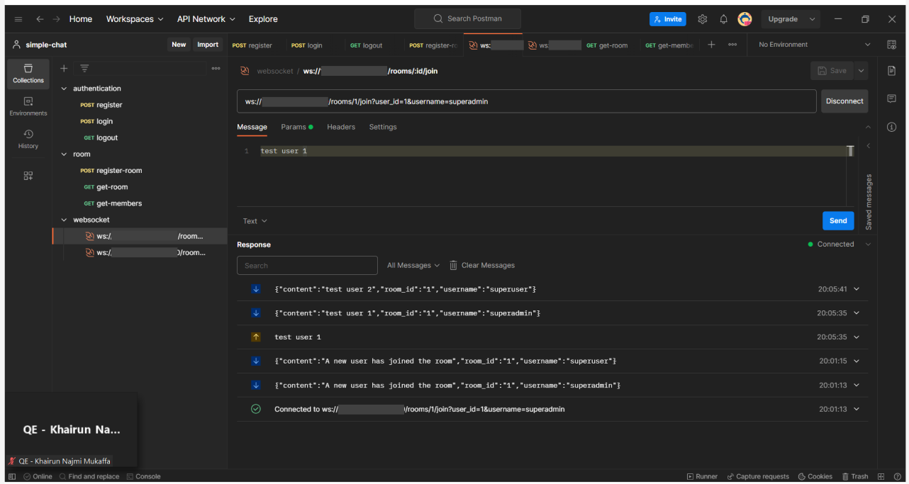

# simple-chat

### Entity Relational Diagram
Users and rooms is many to many relationship so that it would give us conjunction table : messages and members.


### How To Run
If you want to run the app locally, you can use Docker to containerize the application and also set up Postgres in Docker. This way, you can ensure consistent environments and easily manage dependencies.
You can setup postgres by this way:
- Pull the postgres docker image from the official docker registry
```
docker pull postgres-alpine:latest
```

- Run a postgres container
```
docker run --name postgres15 -p 5432:5432 -e POSTGRES_USER=root -e POSTGRES_PASSWORD=@Secret123 -d postgres:15-alpine
```

- To Access postgres you can run
```
docker exec -it postgres15 psql
```

### Websocket on Postman 





### Authors

The Playground Pro project is developed by the following individuals:

-   **Dimas Yudhana** - [GitHub](https://github.com/dimasyudhana)

Feel free to reach out to the authors for any inquiries or contributions related to the project.